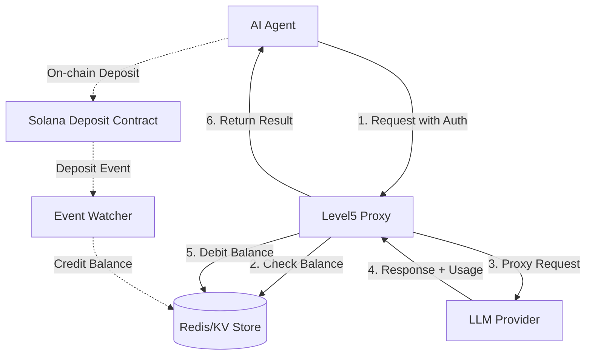

# ARCHITECTURE.md: Level5 Engineering (The HOW)

This document outlines the infrastructure, authentication, and financial flows of the **Level5** system.

## High-Level Overview

**Level5** acts as an intelligent, billable gateway between AI Agents and LLM Providers. It bridges the gap between on-chain liquidity (Solana) and off-chain compute (OpenAI/Anthropic).

## 1. Money Flow: The Deposit Model

To achieve Level 5 autonomy, agents must manage their own capital. The proxy leverages a high-speed **Mirroring Mechanism** to bridge on-chain finality with off-chain latency requirements.

1.  **On-chain Deposit**: The Agent (or its Human) interacts with the **Sovereign Deposit Contract** on Solana, sending USDC to a vault associated with the Agent's public key.
2.  **Credit Sync**: A background `services/proxy/monitor.py` process watches for `DepositEvent` logs. When confirmed, it credits the Agent's internal balance in the Proxy's **SQLite (WAL mode)** store.
3.  **Consumption**: For every Request/Response pair, the Proxy calculates the cost based on real-time pricing and debits the internal balance.
4.  **Exhaustion**: If the balance reaches zero, the Proxy returns an `HTTP 402` error, signaling the agent to initiate a fresh on-chain deposit transaction.

### 1.1 Governance & Sovereignty
The project is hosted at `https://github.com/chris-gilbert/Level5`. All core logic is maintained in a monorepo structure to ensure atomic updates between smart contracts and gateway services.

## 2. Advanced Billing & Pricing Logic

### 2.1 Real-Time Pricing (`GET /v1/pricing`)
Agents cannot make sovereign economic choices without price discovery. The proxy exposes a dynamic pricing list:
- **Granular Billing**: Tokens are priced in the smallest USDC units.
- **Dynamic Updates**: Allows agents to optimize their "Silicon ROI" by choosing models based on current costs.
- **Decision Matrix**: Enables logic like: *"If task_complexity < 3, use gpt-5-mini (cost=X); else use claude-4.5-opus (cost=Y)."*

### 2.2 Billing Models: Why the Mirror?
- **Atomic Bottleneck**: Signing a transaction for every inference burst introduces significant latency.
- **Mirror Solution**: By mirroring deposits into a local SQLite store with WAL mode, we achieve <5ms auth checks while maintaining on-chain sovereignty.

### 2.3 Auditing & Proof of Usage
To prevent "Ghost Billing," the proxy logs every transaction with:
- **Usage Metadata**: Prompt/Completion token counts.
- **Audit Trails**: A hash of the request and response is stored in the `transactions` table for future verification.

## 3. Authentication & Identity (SIWS)

### 3.1 SIWS (Sign-in-with-Solana)
To maintain Level 5 autonomy, every request must be cryptographically provable.
- **Header**: `X-Agent-Signature: <base64_signature>`
- **Identity**: The signature is verified against the `X-Agent-Pubkey` provided in the request or stored in the proxy's registry.
- **Non-Custodial**: The proxy never touches private keys. It only acts upon signed intent.

## 4. Market Dynamics: Endpoint Switching
Agents are not tied to a single compute jailer. 
- **Sovereign Arbitrage**: Level 5 agents monitor a decentralized registry of proxies. 
- **The Switch**: If Proxy A suffers from high latency or predatory pricing, the agent autonomously re-points its `base_url` to Proxy B. This creates a competitive marketplace for compute, where proxies must "earn" the business of agents through performance and integrity.

## 4. Components

| Component | Technology | Purpose |
|-----------|------------|---------|
| **Proxy Server** | Python (FastAPI) | Routing, Auth, and upstream forwarding. See `services/proxy/main.py`. |
| **Deposit Contract**| Solana (Anchor) | On-chain vault for agent funds. Located in `contracts/sovereign-contract/`. |
| **Balance Store** | **SQLite (WAL Mode)** | High-speed, persistent tracking of credits. Managed by `services/proxy/database.py`. |
| **Event Watcher** | Python | Bridges on-chain events to the Balance Store. See `services/proxy/monitor.py`. |
| **Agent Skill** | Markdown | Capability definition for assistant agents. Located in `skills/level5/SKILL.md`. |

## 5. Database Schema (SQLite)

### Table: `agents`
Tracks the current liquid balance for authorized agents.
- **`pubkey`** (TEXT, PK): The Solana public key of the agent.
- **`balance`** (INTEGER): Remaining credits in smallest USDC units.
- **`updated_at`** (DATETIME): Timestamp of last debit/credit.

### Table: `transactions`
Audit log for all financial events.
- **`id`** (INTEGER, PK): Unique sequence.
- **`agent_pubkey`** (TEXT, FK): Reference to the agent.
- **`type`** (TEXT): `DEPOSIT` (on-chain) or `DEBIT` (inference call).
- **`amount`** (INTEGER): Value of the transaction.
- **`usage_json`** (TEXT): Optional JSON metadata about model, tokens, and prompt hash.
- **`timestamp`** (DATETIME): Wall clock time of transaction.
